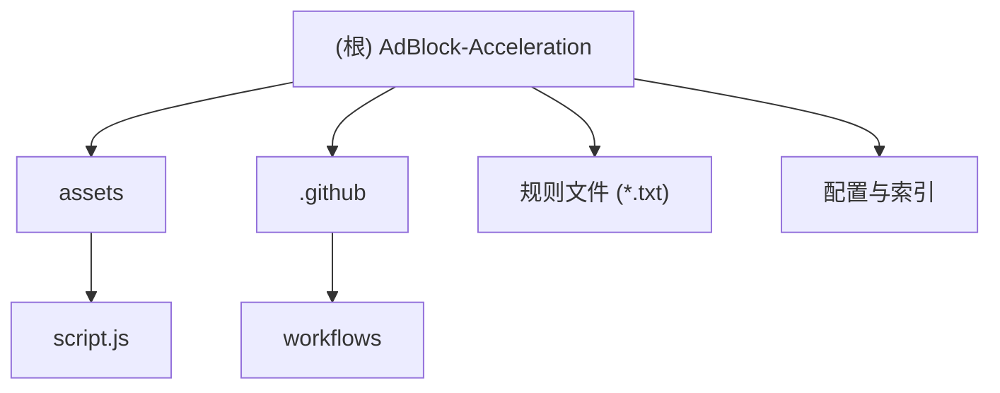

# AdBlock-Acceleration 项目文档

## 项目愿景

为常见去广告工具（AdGuard、uBlock Origin、AdGuard Home 等）提供国际/中国网络可用的规则加速订阅服务。通过多镜像 CDN 分发，实现零代理快速更新，解决中国大陆用户因规则托管在境外服务器导致更新缓慢或失败的痛点。

## 架构总览

本项目是一个 GitHub Pages 静态网站，核心功能包括：

1. **规则自动抓取**：通过 GitHub Actions 每 6 小时从上游源抓取最新广告过滤规则
2. **多镜像分发**：通过 4 个 CDN 镜像（GHUCS、jsDelivr、cosr、gitmirror）分发规则文件
3. **Web 索引页**：提供搜索、镜像选择、单条/批量复制功能的 Web 界面
4. **文件完整性校验**：通过 checksums.txt 和 manifest.json 提供文件校验

## 模块结构图



## 模块索引

| 模块路径 | 语言/类型 | 职责 |
|---------|----------|------|
| `/` | HTML/JS/CSS | 项目根目录，包含 Web 索引页和规则文件 |
| `/assets/` | JavaScript | 前端交互逻辑，负责规则展示、搜索、复制功能 |
| `/` (规则文件) | TXT | 22 个广告过滤规则文件，由 CI 自动更新 |
| `/.github/workflows/` | YAML | GitHub Actions 自动化工作流，定时抓取规则 |

## 运行与开发

### 本地开发

```bash
# 启动本地服务器（需要 Python 或 Node.js）
python3 -m http.server 8000
# 或
npx serve .

# 访问 Web 索引页
open http://localhost:8000/index.html
```

### 项目结构

```
AdBlock-Acceleration/
├── index.html                    # Web 索引页主文件
├── assets/
│   ├── script.js                 # 前端交互逻辑
│   └── favicon.ico               # 网站图标
├── manifest.json                 # 规则文件元数据（大小、哈希、时间戳）
├── checksums.txt                 # SHA256 校验和
├── README.md                     # 中文说明文档
├── README_EN.md                  # English documentation
├── ANNOUNCEMENTS_CN.md           # 中文公告历史
├── LICENSE                       # GPL-3.0 许可证
├── .gitignore                    # Git 忽略规则
└── *.txt                         # 广告过滤规则文件（22 个）
```

## 测试策略

本项目为静态网站，无自动化测试。验证方式：

1. **本地验证**：使用本地服务器打开 index.html，检查功能正常
2. **完整性校验**：运行 `sha256sum -c checksums.txt` 验证规则文件完整性
3. **CI 验证**：GitHub Actions 自动更新规则并推送到仓库

## 编码规范

### 前端代码规范

- 使用原生 JavaScript（ES6+），无框架依赖
- 使用 Tailwind CSS（CDN）进行样式管理
- 支持深色/浅色/跟随系统三种主题模式
- 响应式设计，适配移动端

### 规则文件命名规范

- 使用下划线连接单词：`AdGuard_Simplified_Domain_Names_Filter.txt`
- 保持文件名简洁明确
- 避免特殊字符（除下划线外）

## AI 使用指引

### 开发建议

1. **修改前端代码**：主要编辑 `assets/script.js` 和 `index.html`
2. **添加新规则**：
   - 在 `assets/script.js` 的 `rules` 数组中添加规则定义
   - 在 `manifest.json` 中添加对应文件元数据
   - 更新 `checksums.txt`
3. **修改镜像配置**：编辑 `assets/script.js` 中的 `mirrors` 对象

### 注意事项

- 规则文件由 GitHub Actions 自动更新，不要手动修改
- `manifest.json` 和 `checksums.txt` 由 CI 生成，不要手动编辑
- 前端代码使用 Tailwind CSS CDN，无需构建步骤

## 变更记录 (Changelog)

- 2026-05-03 22:11：初始生成项目文档
